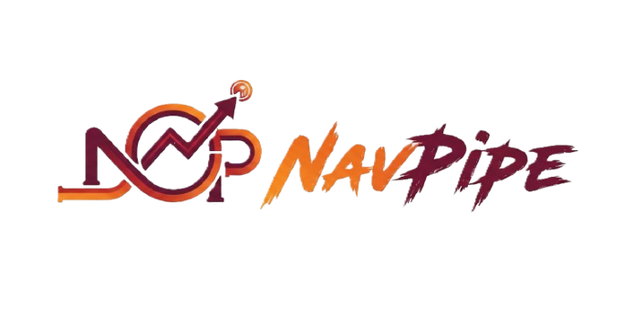

# NavPipe

**NavPipe** is a lightweight, typed Python SDK for fetching mutual fund NAV history from the unofficial API at:

👉 https://www.mfapi.in

It provides:

- 🚀 Simple synchronous interface  
- ⚡ Async HTTP under the hood  
- 📊 Native `polars` DataFrame output  
- 🧵 Built-in concurrency control  
- ⏱ Optional rate limiting  
- 🔁 Automatic retries with exponential backoff  
- 🧾 Fully typed models using `msgspec`  

> ⚠️ This project is **not affiliated with mfapi.in**. It is an unofficial wrapper.

---

## Important: Scheme Codes

NavPipe requires **scheme codes** to be provided manually.

You can find scheme codes directly on:

👉 https://www.mfapi.in

Example:

    https://api.mfapi.in/mf/119551

Here, `119551` is the scheme code.

NavPipe does not (yet) provide scheme discovery or search functionality.  
This may be added in future versions.

---

## Installation

```bash
pip install navpipe
```


---

## Requirements

- Python **3.9+**
- polars
- aiohttp
- msgspec
- aiolimiter

---

## Quick Start

```python
from navpipe.api import NavPipe

client = NavPipe(
max_concurrency=5,
rate_limit_per_sec=3,
)

df = client.nav_history(
scheme_codes=[119551, 120503],
start_date="2023-01-01",
end_date="2023-12-31",
)

print(df)
```


### Output

Returns a `polars.DataFrame` with:

| column        | type     |
|--------------|----------|
| scheme_code  | int      |
| scheme_name  | str      |
| date         | pl.Date  |
| nav          | float    |

---

## Public API (v0.1.0)

### NavPipe

```python
NavPipe(
*,
max_concurrency: int = 5,
rate_limit_per_sec: int | None = 3,
)
```

### nav_history(...)

```python
nav_history(
scheme_codes: Iterable[int],
*,
start_date: str | None = None,
end_date: str | None = None,
) -> pl.DataFrame
```


- `scheme_codes` – Iterable of mutual fund scheme codes  
- `start_date` / `end_date` – Optional date range (must be provided together)  
- Returns a vertically concatenated `polars.DataFrame`

---

## Design Philosophy

NavPipe aims to:

- Expose a clean synchronous interface
- Use async I/O internally for performance
- Provide strong typing
- Return dataframe-native results
- Stay minimal and focused

Architecture layers:

- Async transport (aiohttp)
- Structured decoding (msgspec.Struct)
- Transformation to polars
- Sync bridge for user-friendly API

---

## Error Handling

- Retries on:
  - 429
  - 500
  - 502
  - 503
  - 504
- Exponential backoff with jitter
- Raises `RuntimeError` after max retries
- Validates date range parameters

---

## Current Scope (v0.1.0)

- Fetch NAV history  
- Bulk concurrent fetching  
- Rate limiting  
- Typed decoding  
- Polars transformation  

---

## Roadmap / Ideas

Planned or possible additions:

- Scheme discovery/search API
- Fund metadata endpoints
- Local caching layer
- Async-first public API
- Pandas and other dataframe output options
- CLI interface
- Response validation layer
- Custom error classes
- Built-in scheme code registry

Suggestions and ideas are welcome.

---

## Contributing

Contributions are welcome.

If you'd like to:

- Add features  
- Improve typing  
- Improve performance  
- Add caching  
- Improve documentation  
- Add tests  
- Suggest API improvements  

Open an issue or submit a pull request.

---

## Version

0.1.0

This is an early release with a minimal stable surface.  
Breaking changes may occur before 1.0.0.

---

## License

Apache 2.0
