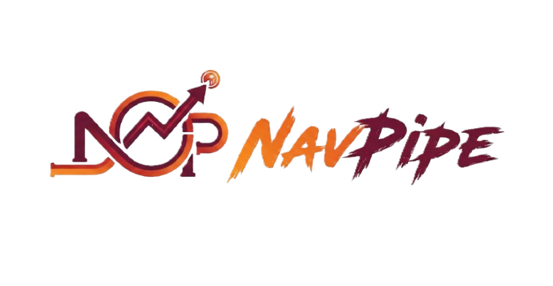

# NavPipe

[](https://pypi.org/project/navpipe/)
[](https://pypi.org/project/navpipe/)
[](https://www.rust-lang.org/)
[](https://github.com/MSM2002/NavPipe/actions)
[](https://github.com/MSM2002/NavPipe/blob/main/LICENSE)
[](https://pypi.org/project/navpipe/)
[](https://github.com/MSM2002/navpipe/stargazers)
[](https://github.com/MSM2002/navpipe/network/members)


**NavPipe** is a high-performance, compiled Python SDK for fetching mutual fund NAV history from the unofficial API at:

👉 https://www.mfapi.in

By moving the core logic to **Rust**, NavPipe now offers massive concurrency with minimal overhead, returning results directly into **Polars** memory.

### Why the Rust rewrite?
- 🦀 **Safety:** Memory-safe concurrent fetching using the `tokio` runtime.
- 🚀 **Speed:** Zero-copy data transfers between Rust and Python via `pyo3-polars`.
- 📊 **Lazy-First:** Native support for Polars `LazyFrame`, allowing you to optimize queries before they run.
- 🧵 **True Parallelism:** Bypasses the Python Global Interpreter Lock (GIL) for network I/O and data transformation.

---

## Installation

```bash
pip install navpipe
```
---

## Quick Start

```python
import navpipe
import polars as pl

# Initialize the Rust-backed client
client = navpipe.NavPipe(max_concurrency=10)

# Eager execution: Returns a polars.DataFrame immediately
df = client.nav_history(
    scheme_codes=[119551, 120503],
    start_date="2023-01-01",
    end_date="2023-12-31",
)

# Lazy execution: Returns a polars.LazyFrame for complex pipelines
lazy_plan = client.nav_history_lazy(
    scheme_codes=[119551, 120503]
)

# Chain Polars operations natively
results = lazy_plan.filter(pl.col("nav") > 50).collect()
print(results)
```

### Output Schema

The Rust engine performs diagonal concatenation to ensure all scheme data is merged efficiently:

|Column|Type|Description|
|------|----|-----------|
|scheme_code|Int64|The MFAPI unique identifier|
|date|Date|The NAV date|
|nav|Float64|The Net Asset Value|

---

## Important: Scheme Codes

NavPipe requires scheme codes to be provided manually. You can find these on:
👉 https://www.mfapi.in

Example: `https://api.mfapi.in/mf/119551` → `119551` is the code.

---

## Public API

`NavPipe(max_concurrency: int)`

Initializes the engine.

- `max_concurrency`: Limits the number of simultaneous HTTP requests using a `tokio::sync::Semaphore`.

`nav_history(...) -> pl.DataFrame`

Eagerly fetches and collects data into a standard Polars DataFrame.

`nav_history_lazy(...) -> pl.LazyFrame`

Returns a Polars LazyFrame. Use this if you are fetching hundreds of schemes and want to apply filters, aggregations, or joins before calling `.collect()`.

---

## Design Philosophy
NavPipe aims to:

- **Move the Heavy Lifting to Rust**: All networking and JSON-to-Arrow transformation happens in compiled code.
- **Polars First**: Treat DataFrames as the primary citizen, avoiding the overhead of Python dictionaries or lists.
- **Async Under the Hood**: Use the tokio multi-threaded scheduler to manage I/O without requiring the user to write async/await code in Python.

**Architecture Layers:**

1. **Transport**: Rust `reqwest` with `rustls` for high-performance HTTP.
2. **Concurrency**: `tokio` semaphore-controlled task spawning.
3. **Transformation**: Native Rust parsing into `polars-core` series.
4. **Bridge**: `PyO3` + `pyo3-polars` for zero-overhead Python integration.

---

## Contributing

We welcome contributions to the Rust core or the Python stubs! Just make sure to open an [issue](https://github.com/MSM2002/navpipe/issues) to discuss it first.

---

## License
Apache 2.0

⚠️ This project is not affiliated with mfapi.in. It is an unofficial wrapper designed for performance.

---
